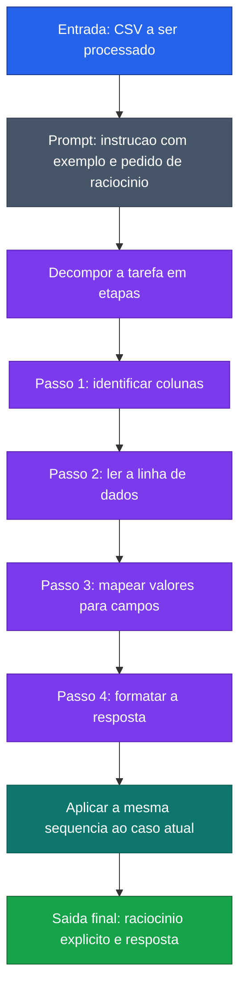

[Voltar ao indice](../README.md)

### Exemplo de prompt (Chain-of-Thought)
Caso de uso: quando a tarefa parece simples, mas voce quer reduzir erro de interpretacao tornando o raciocinio verificavel. Neste exemplo, o modelo explicita como identifica colunas e mapeia valores antes de responder.

Entrada:
```code-block
Extraia os dados do CSV e retorne nome, sobrenome e matricula.
Pense passo a passo antes de retornar o resultado.

Exemplo

Entrada:
nome,sobrenome,matricula
Geo,Cavalcante,123

Raciocinio:
1. Identifico que o CSV possui 3 colunas: nome, sobrenome e matricula
2. Leio a primeira linha de dados: Geo,Cavalcante,123
3. Mapeio cada valor para sua coluna correspondente
4. Formato a saida com os campos identificados

Saida:
nome: Geo, sobrenome: Cavalcante, matricula: 123

Agora processe esta entrada do arquivo anexado.
Mostre seu raciocinio passo a passo antes da resposta final.
```

### Diagrama de Fluxo



> **Caracteristica:** O modelo e instruido a pensar passo a passo, exibindo o raciocinio intermediario antes da resposta final. Reduz erros em tarefas que exigem logica sequencial.
