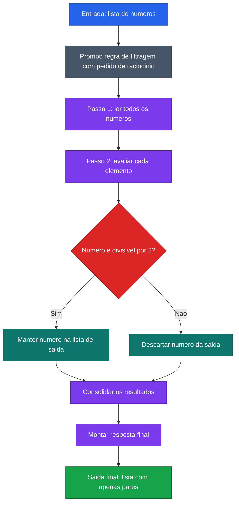

[Voltar ao indice](../README.md)

### Exemplo de prompt (Chain-of-Thought) — Filtrar numeros pares
Caso de uso: quando existe uma regra logica simples, mas o processo precisa ficar transparente passo a passo. Aqui, o modelo mostra como avalia cada numero antes de montar a lista final.

Entrada:
```code-block
Analise a lista abaixo e retorne apenas os numeros pares.

Antes de responder:
1. leia todos os numeros
2. verifique um por um
3. identifique quais sao pares
4. so entao monte a resposta final

Exemplo

Entrada:
[3, 8, 11, 14, 21]

Raciocinio:
1. Leio os numeros 3, 8, 11, 14 e 21
2. Verifico quais sao divisiveis por 2
3. 8 e 14 sao pares
4. Monto a resposta final apenas com os numeros pares

Saida:
[8, 14]

Agora processe a entrada abaixo e mostre o raciocinio passo a passo antes da resposta final.

Entrada:
[7, 22, 35, 40, 53, 66, 71, 88]
```

### Diagrama de Fluxo



> **Caracteristica:** CoT aplicado a filtragem logica. O modelo percorre cada elemento, aplica a regra de divisibilidade e justifica a inclusao ou exclusao antes de montar o resultado.
