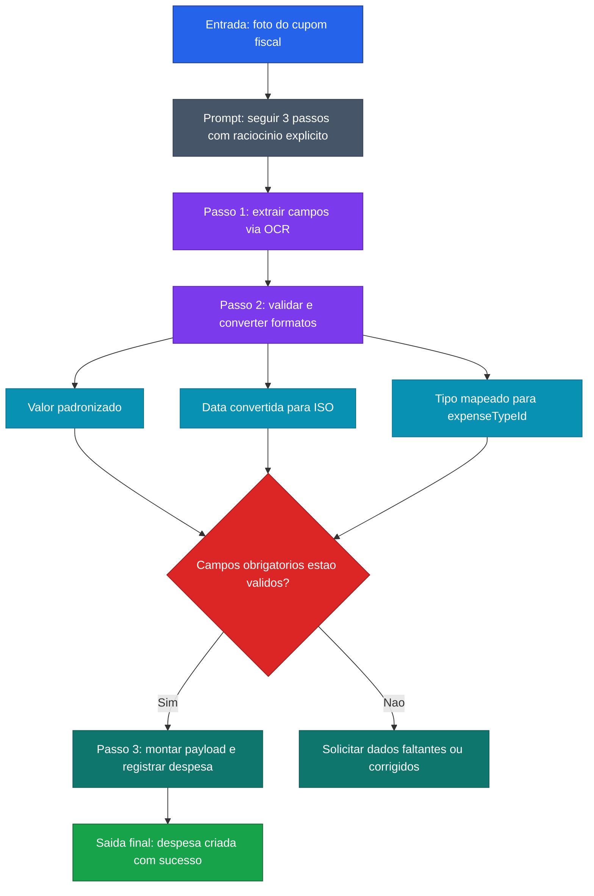

[Voltar ao indice](../README.md)

### Exemplo de prompt (Chain-of-Thought) — Lançamento de Despesa
Caso de uso: quando um fluxo operacional tem varias etapas dependentes e voce quer deixar a sequencia de validacao explicita. Neste caso, o modelo extrai dados de um cupom, valida formatos e monta o payload final da despesa.

Entrada:
```code-block
O usuario enviou a foto de um cupom fiscal. Pense passo a passo.

Passo 1 - OCR: Extraia os dados do cupom
- Estabelecimento: Restaurante Bom Sabor
- Valor: "1.245,80"
- Data: "15/03/2026"
- Tipo: Alimentação

Passo 2 - Validação: Verifique e converta os dados
- Valor: "1.245,80" → removo ponto de milhar → "1245,80" → troco virgula por ponto → 1245.80
- Data: "15/03/2026" → converto para ISO → "2026-03-15"
- Tipo: Alimentação → expenseTypeId: 3
- Todos os campos obrigatorios presentes? Sim

Passo 3 - Inserção: Monte o payload e crie a despesa
- establishment: "Restaurante Bom Sabor"
- amount: 1245.80
- date: "2026-03-15"
- expenseTypeId: 3
- observation: "almoço com cliente"

Despesa criada com sucesso.

Agora processe o cupom abaixo seguindo os mesmos 3 passos.
```

### Diagrama de Fluxo



> **Caracteristica:** CoT aplicado a um fluxo real de negocio (OpenTrips). Tres etapas encadeadas: extracao via OCR, validacao com conversao de formatos, e insercao com payload estruturado.
