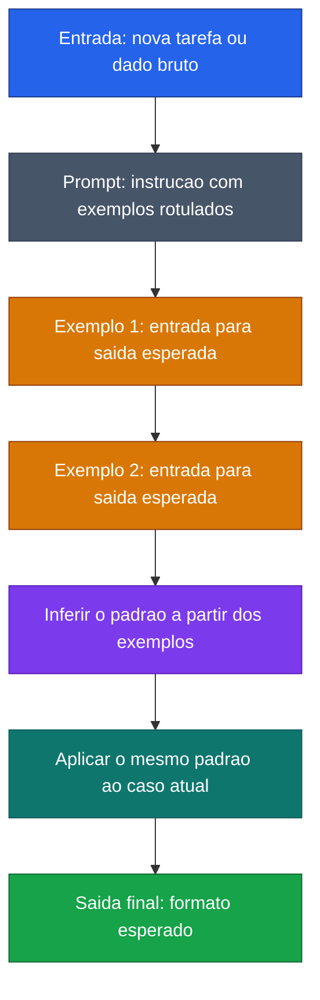

[Voltar ao indice](../README.md)

### Exemplo de prompt (Few-Shot)
Caso de uso: quando a tarefa exige um formato de resposta especifico e vale a pena mostrar poucos exemplos para ensinar o padrao esperado. Aqui, os exemplos guiam a conversao de CSV para uma saida textual estruturada.

Entrada:
```code-block
Extraia os dados do CSV e retorne no formato dos exemplos abaixo.

Exemplo 1

Entrada:
nome,sobrenome,matricula
Geo,Cavalcante,123

Saída:
nome: Geo, sobrenome: Cavalcante, matricula: 123


Exemplo 2

Entrada:
nome,sobrenome,matricula
Maria,Silva,456

Saída:
nome: Maria, sobrenome: Silva, matricula: 456

Agora processe esta entrada do arquivo anexado.
```

### Diagrama de Fluxo



> **Caracteristica:** Exemplos rotulados ensinam o formato esperado. O modelo generaliza o padrao para novas entradas.
