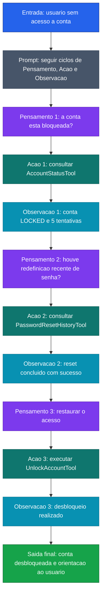

[Voltar ao indice](../README.md)

### Exemplo de prompt (ReAct) — Atendimento de Suporte
Caso de uso: quando o problema precisa ser investigado usando ferramentas externas antes da resposta final. Neste exemplo, o modelo atua como suporte, consulta status da conta, verifica historico e executa a acao correta.

Entrada:
```code-block
O usuario informou que nao consegue acessar a conta. Resolva usando ReAct.

Passo 1 - Pensamento: Verifique se a conta esta bloqueada
Acao: Use a tool `AccountStatusTool` para consultar o status da conta
Observacao:
- accountStatus: "LOCKED"
- failedLoginAttempts: 5

Passo 2 - Pensamento: Verifique se houve redefinicao recente de senha
Acao: Use a tool `PasswordResetHistoryTool` para consultar os eventos de redefinicao
Observacao:
- lastPasswordReset: "2026-03-17T10:14:00Z"
- resetCompleted: true

Passo 3 - Pensamento: Se a senha foi redefinida com sucesso, o proximo passo e restaurar o acesso
Acao: Use a tool `UnlockAccountTool` para desbloquear a conta
Observacao:
- unlockStatus: "SUCCESS"

Resposta final:
- causa provavel: conta bloqueada por excesso de tentativas de login
- evidencias: status LOCKED, 5 tentativas falhas e redefinicao de senha concluida com sucesso
- orientacao recomendada: informar ao usuario que a conta foi desbloqueada e pedir novo teste de acesso

Agora processe o caso abaixo seguindo os mesmos 3 passos.
```

### Diagrama de Fluxo



> **Caracteristica:** Ciclo ReAct (Reasoning + Acting). Cada iteracao segue o padrao Pensamento, Acao (tool call) e Observacao, ate reunir evidencias suficientes para a resposta final.
