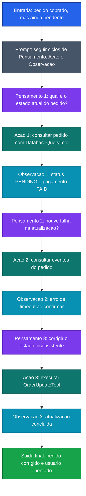

[Voltar ao indice](../README.md)

### Exemplo de prompt (ReAct) — Consulta de Pedido
Caso de uso: quando existe uma inconsistencia entre o que aconteceu no sistema e o que o usuario enxerga, e e preciso investigar com consultas e acoes corretivas. Aqui, o fluxo verifica o pedido, identifica a falha e corrige o estado.

Entrada:
```code-block
O usuario informou que o pedido foi cobrado, mas aparece como pendente no sistema. Resolva usando ReAct.

Passo 1 - Pensamento: Verifique o status atual do pedido no banco de dados
Acao: Use a tool `DatabaseQueryTool` para consultar a tabela de pedidos pelo `orderId`
Observacao:
- orderId: 84521
- status: "PENDING"
- paymentStatus: "PAID"
- updatedAt: "2026-03-18T09:42:00Z"

Passo 2 - Pensamento: Se o pagamento foi confirmado, preciso verificar se houve falha na atualizacao do pedido
Acao: Use a tool `DatabaseQueryTool` para consultar a tabela de eventos de processamento desse pedido
Observacao:
- event: "ORDER_STATUS_UPDATE"
- result: "ERROR"
- message: "timeout ao atualizar status para CONFIRMED"

Passo 3 - Pensamento: O pedido foi pago, mas a atualizacao falhou; o proximo passo e corrigir o estado inconsistente
Acao: Use a tool `OrderUpdateTool` para atualizar o status do pedido para `CONFIRMED`
Observacao:
- updateStatus: "SUCCESS"

Resposta final:
- causa provavel: falha na atualizacao do status do pedido apos confirmacao do pagamento
- evidencias: pedido com `paymentStatus` igual a `PAID`, status ainda `PENDING` e evento com erro de timeout
- orientacao recomendada: informar ao usuario que o pedido foi corrigido e solicitar nova validacao no sistema

Agora processe o caso abaixo seguindo os mesmos 3 passos.
```

### Diagrama de Fluxo



> **Caracteristica:** ReAct aplicado a inconsistencia de dados. O ciclo Pensamento-Acao-Observacao investiga camada por camada ate resolver o estado inconsistente.
