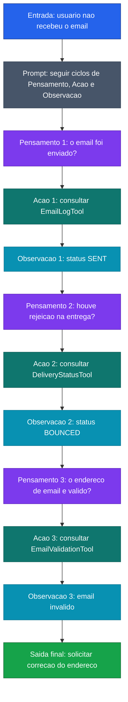

[Voltar ao indice](../README.md)

### Exemplo de prompt (ReAct) — Validacao de Email
Caso de uso: quando a causa de um problema pode estar em varias etapas de um fluxo externo e o modelo precisa investigar em funil. Neste exemplo, ele verifica envio, entrega e validade do endereco antes de concluir.

Entrada:
```code-block
O usuario informou que nao recebeu o email de confirmacao. Resolva usando ReAct.

Passo 1 - Pensamento: Verifique se o email foi enviado
Acao: Use a tool ficticia `EmailLogTool` para buscar o envio pelo `userId`
Observacao:
- status: "SENT"

Passo 2 - Pensamento: Se foi enviado, verifique se houve rejeicao
Acao: Use a tool ficticia `DeliveryStatusTool` para consultar a entrega
Observacao:
- deliveryStatus: "BOUNCED"

Passo 3 - Pensamento: O email foi rejeitado; preciso identificar o motivo
Acao: Use a tool ficticia `EmailValidationTool` para validar o endereco
Observacao:
- emailValid: false

Resposta final:
- causa provavel: email invalido
- evidencias: envio realizado, entrega rejeitada e validacao negativa
- orientacao recomendada: solicitar correcao do endereco de email

Agora processe o caso abaixo seguindo os mesmos 3 passos.
```

### Diagrama de Fluxo



> **Caracteristica:** ReAct com investigacao em funil: envio, entrega e validacao. Cada observacao refina a hipotese ate chegar na causa raiz.
