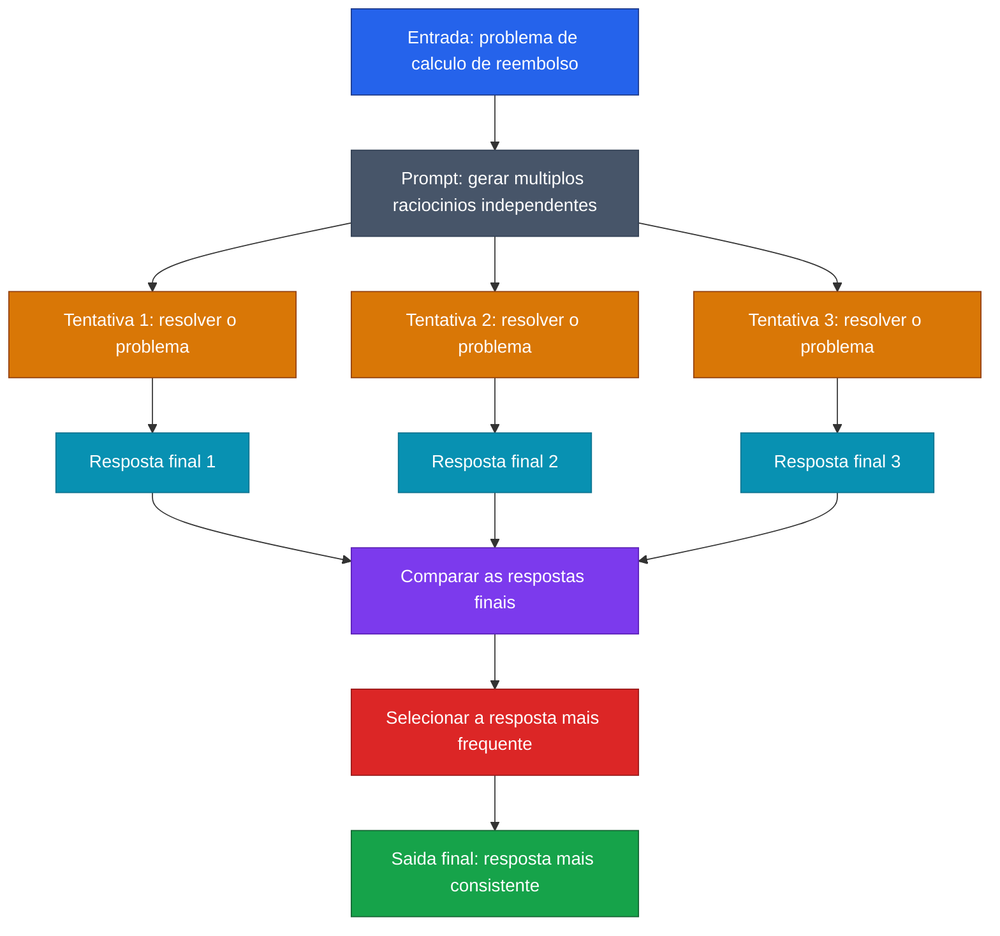

[Voltar ao indice](../README.md)

### Exemplo de prompt (Self-Consistency) — Calculo de Reembolso
Caso de uso: quando o problema exige raciocinio, mas voce quer reduzir a chance de erro pedindo varias resolucoes independentes e escolhendo a resposta que mais se repete. Aqui, o objetivo e calcular corretamente o valor de um reembolso.

Entrada:
```code-block
Um colaborador fez uma compra de R$ 240,00 para uma viagem corporativa.
Pela politica da empresa:
- despesas de alimentacao reembolsam 80% do valor
- despesas acima de R$ 150,00 exigem desconto de R$ 20,00 no valor final do reembolso

Use self-consistency para resolver:
1. Gere 3 raciocinios independentes para calcular o valor do reembolso
2. Compare apenas as respostas finais de cada raciocinio
3. Escolha a resposta que aparecer com maior frequencia
4. Retorne:
   - respostas finais de cada tentativa
   - resposta mais consistente
   - resposta final

Problema:
Qual e o valor final do reembolso?
```

### Diagrama de Fluxo



> **Caracteristica:** Self-Consistency nao depende de um unico raciocinio. O modelo tenta resolver o problema por caminhos independentes e usa a convergencia das respostas finais para aumentar a confianca no resultado.
