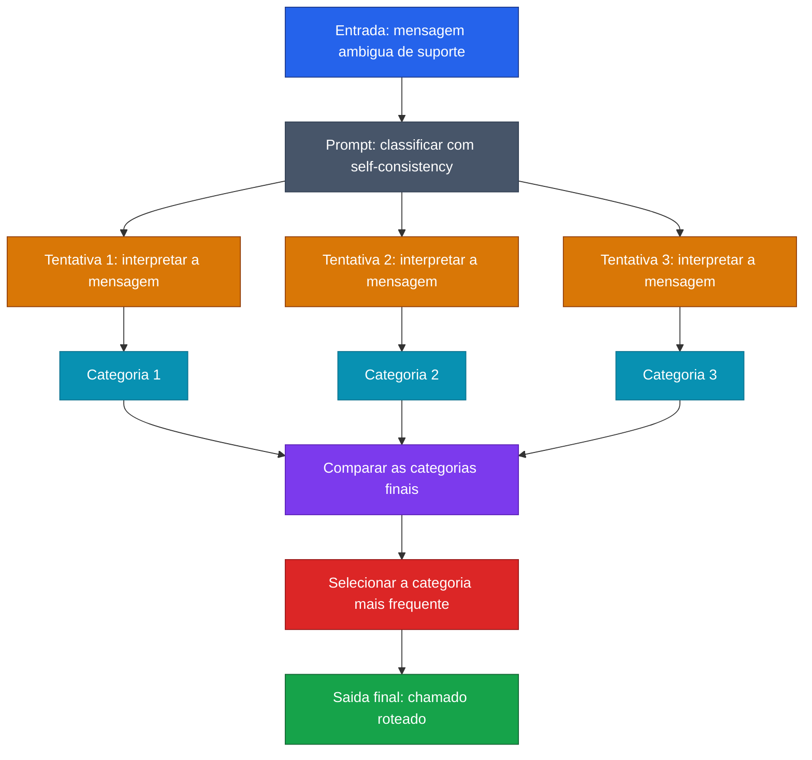

[Voltar ao indice](../README.md)

### Exemplo de prompt (Self-Consistency) — Roteamento de Chamado
Caso de uso: quando um texto pode ser interpretado de mais de uma forma e voce quer reduzir classificacoes inconsistentes. Neste exemplo, o modelo classifica um chamado de suporte mais de uma vez e escolhe a categoria mais consistente.

Entrada:
```code-block
Preciso classificar um chamado de suporte em uma das categorias abaixo:
- `Acesso`: problemas de login, senha, bloqueio de conta ou permissao
- `Financeiro`: cobranca, fatura, pagamento ou reembolso
- `Tecnico`: erro no sistema, lentidao, falha de integracao ou bug de funcionalidade

Mensagem do usuario:
"Nao consigo concluir a compra no sistema. O pagamento foi aprovado no cartao, mas a tela continua mostrando erro e o pedido nao aparece como confirmado."

Use self-consistency para decidir:
1. Gere 3 avaliacoes independentes da categoria do chamado
2. Em cada avaliacao, explique brevemente o raciocinio
3. Compare apenas a classificacao final de cada tentativa
4. Escolha a categoria que aparecer com maior frequencia
5. Retorne:
   - categoria final de cada tentativa
   - categoria mais consistente
   - resposta final
```

### Diagrama de Fluxo



> **Caracteristica:** Self-Consistency tambem funciona bem em roteamento e classificacao textual. O ganho vem de repetir a avaliacao do mesmo caso por caminhos independentes e usar a categoria que mais converge entre as tentativas.
