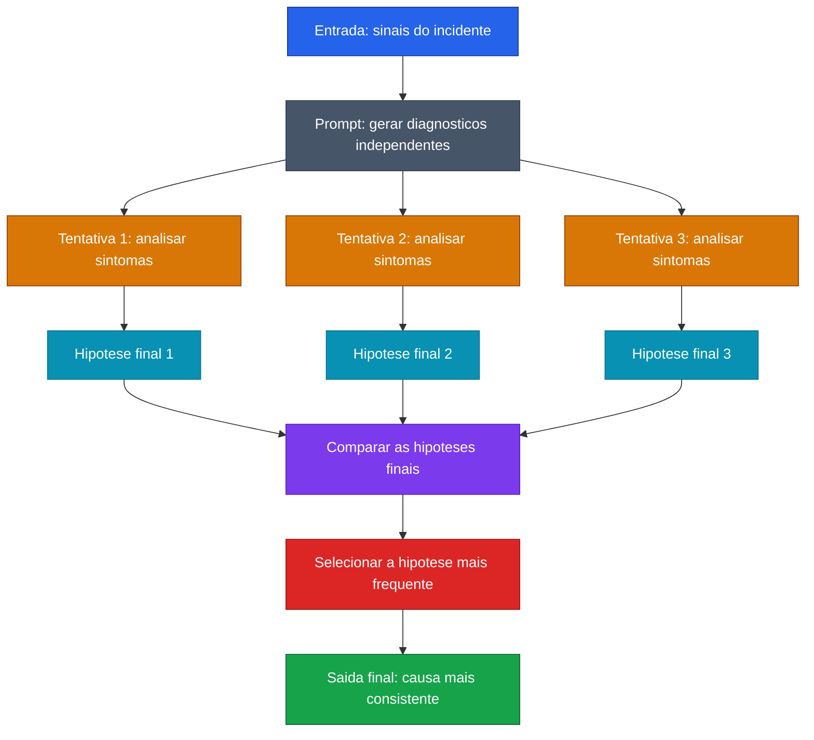

[Voltar ao indice](../README.md)

### Exemplo de prompt (Self-Consistency) — Diagnostico Inicial de Incidente
Caso de uso: quando ha ambiguidade entre causas possiveis e voce quer escolher a hipotese mais robusta sem depender de uma unica linha de raciocinio. Aqui, o modelo gera varios diagnosticos iniciais e seleciona a causa mais consistente.

Entrada:
```code-block
Preciso identificar a causa mais provavel de um incidente em producao.

Sintomas observados:
- aumento repentino de erro 503
- CPU dos pods normal
- latencia do banco normal
- fila de processamento crescendo rapidamente
- logs mostram falhas intermitentes ao chamar um servico externo de pagamento

Hipoteses possiveis:
1. gargalo de CPU na aplicacao
2. lentidao no banco de dados
3. instabilidade no servico externo de pagamento
4. erro de configuracao de cache

Use self-consistency para responder:
1. Gere 3 analises independentes da causa mais provavel
2. Em cada analise, escolha uma hipotese e justifique brevemente
3. Compare apenas a hipotese final de cada tentativa
4. Escolha a hipotese que aparecer com maior frequencia
5. Retorne:
   - hipotese final de cada tentativa
   - hipotese mais consistente
   - resposta final
```

### Diagrama de Fluxo



> **Caracteristica:** Em cenarios de diagnostico, Self-Consistency ajuda a evitar conclusoes precipitadas. A resposta final passa a depender da convergencia entre varias analises independentes, e nao de uma unica tentativa.
