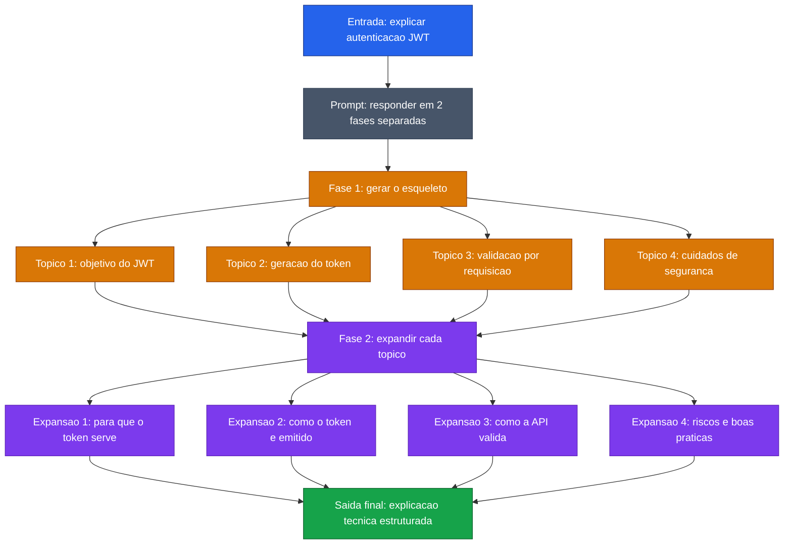

[Voltar ao indice](../README.md)

### Exemplo de prompt (Skeleton-of-Thought) — Autenticacao JWT
Caso de uso: quando a resposta final precisa ser bem organizada e vale a pena separar primeiro a estrutura e depois a explicacao. Aqui, o modelo monta o esqueleto de uma explicacao sobre JWT antes de expandir cada topico.

Entrada:
```code-block
Explique como funciona autenticacao com JWT em uma API REST usando Skeleton-of-Thought.

Siga estas 2 fases:
1. Primeiro, gere apenas o esqueleto da resposta com 4 topicos curtos.
2. Depois, expanda cada topico com uma explicacao objetiva para um desenvolvedor junior.

Nao misture as fases. Na primeira fase, entregue so o esqueleto.

Use este formato:
Esqueleto:
1. objetivo do JWT
2. geracao do token
3. validacao em cada requisicao
4. cuidados de seguranca

Resposta expandida:
1. ...
2. ...
3. ...
4. ...
```

### Diagrama de Fluxo



> **Caracteristica:** Skeleton-of-Thought separa planejamento e elaboracao. Primeiro define a estrutura minima da resposta; depois desenvolve cada parte com mais clareza e menos omissoes.
