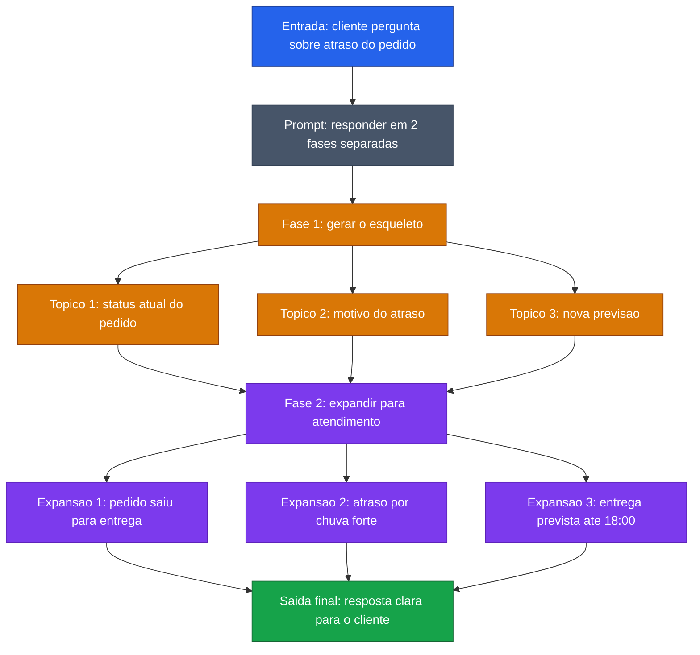

[Voltar ao indice](../README.md)

### Exemplo de prompt (Skeleton-of-Thought) — Atendimento ao Cliente
Caso de uso: quando a mensagem final precisa ser clara e completa, mas primeiro faz sentido definir a ordem dos pontos que serao comunicados. Neste exemplo, o modelo estrutura a resposta ao cliente antes de escrever a versao final.

Entrada:
```code-block
O cliente quer entender por que a entrega do pedido 84521 atrasou.
Contexto:
- status atual: saiu para entrega hoje as 08:10
- motivo do atraso: chuva forte na regiao no dia anterior
- nova previsao: hoje ate 18:00

Responda usando Skeleton-of-Thought.

Siga estas 2 fases:
1. Primeiro, monte apenas um esqueleto curto com os 3 pontos que devem ser explicados.
2. Depois, expanda cada ponto em linguagem clara e educada para o cliente.

Nao misture as fases. Na primeira fase, entregue so o esqueleto.

Use este formato:
Esqueleto:
1. status do pedido
2. motivo do atraso
3. nova previsao

Resposta expandida:
1. ...
2. ...
3. ...
```

### Diagrama de Fluxo



> **Caracteristica:** SoT ajuda a montar respostas de atendimento sem pular pontos importantes. O esqueleto primeiro define a ordem da comunicacao; a expansao depois transforma isso em uma mensagem clara.
