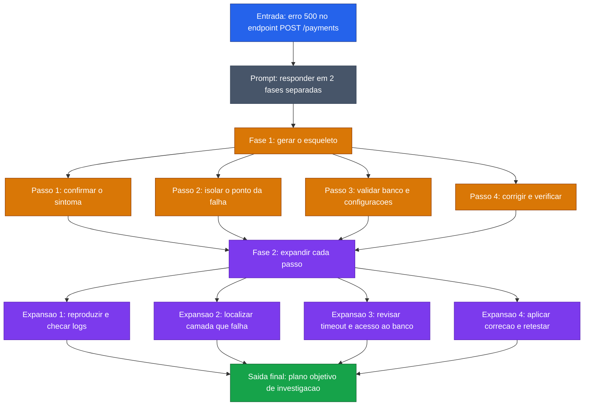

[Voltar ao indice](../README.md)

### Exemplo de prompt (Skeleton-of-Thought) — Analise de Bug
Caso de uso: quando um time precisa de um plano de investigacao bem organizado antes de entrar nos detalhes tecnicos. Aqui, o modelo primeiro define a espinha dorsal da analise do erro e so depois expande cada etapa.

Entrada:
```code-block
Explique como investigar um erro 500 no endpoint `POST /payments` usando Skeleton-of-Thought.

Contexto:
- o erro comecou depois do ultimo deploy
- acontece apenas em pagamentos com cartao
- os logs mostram timeout ao acessar o banco
- o time precisa de um plano curto e objetivo de investigacao

Siga estas 2 fases:
1. Primeiro, crie apenas o esqueleto com os 4 passos principais da investigacao.
2. Depois, detalhe cada passo de forma objetiva.

Nao misture as fases. Na primeira fase, entregue so o esqueleto.

Use este formato:
Esqueleto:
1. confirmar o sintoma
2. isolar o ponto da falha
3. validar banco e configuracoes
4. corrigir e verificar

Resposta expandida:
1. ...
2. ...
3. ...
4. ...
```

### Diagrama de Fluxo



> **Caracteristica:** SoT e util quando a resposta final precisa ser organizada antes de ser detalhada. No debugging, isso ajuda a separar a sequencia principal de investigacao das explicacoes operacionais de cada etapa.
