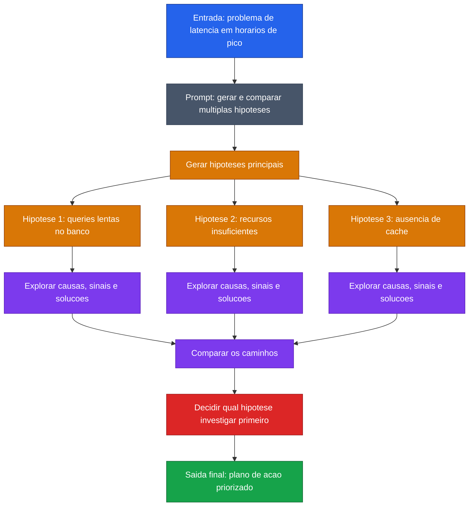

[Voltar ao indice](../README.md)

### Exemplo de prompt (Tree-of-Thought) — Investigação de bug
Caso de uso: quando ha varias hipoteses plausiveis para um problema e a equipe precisa explorar caminhos diferentes antes de priorizar a investigacao. Aqui, o foco e diagnosticar latencia em uma API com base em comparacao entre alternativas.

Entrada:
```code-block
Tenho uma API REST com aumento de latência em horários de pico.
Quero que você analise o problema usando a abordagem Tree of Thought.

Siga este processo:
1. Liste pelo menos 3 hipóteses principais para a lentidão.
2. Para cada hipótese, explore possíveis causas, sinais que confirmariam essa hipótese e possíveis soluções.
3. Compare os caminhos.
4. Indique qual hipótese deve ser investigada primeiro e por quê.
5. Ao final, proponha um plano de ação priorizado.

Contexto:
- A API roda em Kubernetes
- Usa PostgreSQL
- O problema acontece principalmente em endpoints de busca
- O tempo de resposta sobe de 300ms para 4s em horários de pico
```

### Diagrama de Fluxo



> **Caracteristica:** Tree-of-Thought ramifica o problema em multiplas hipoteses, explora cada uma em profundidade, compara os caminhos e converge para a melhor decisao.
