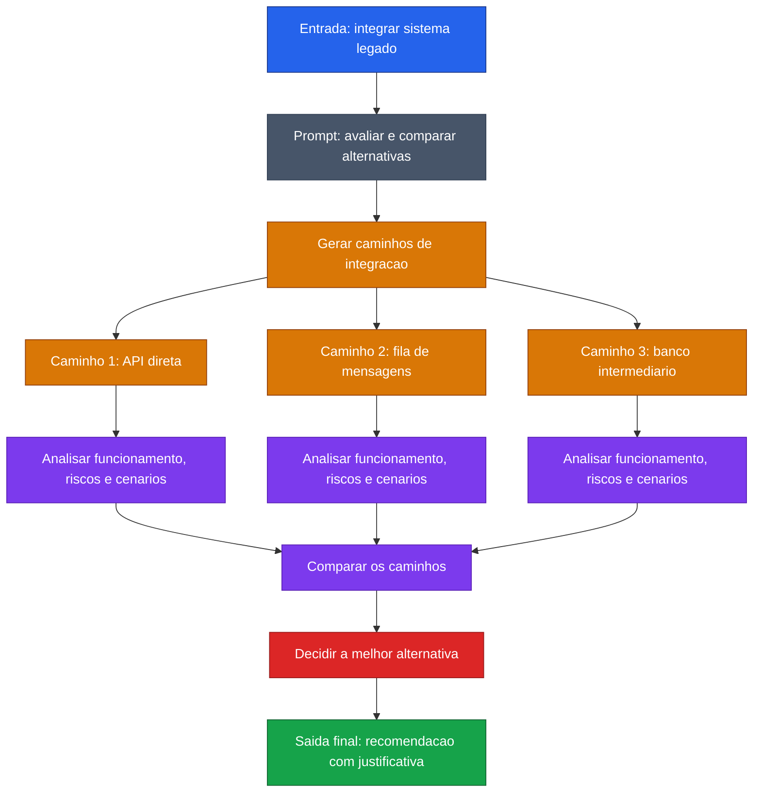

[Voltar ao indice](../README.md)

### Exemplo de prompt (Tree-of-Thought) — Integracao com sistema legado
Caso de uso: quando uma decisao arquitetural tem mais de um caminho valido e o time precisa comparar trade-offs antes de escolher. Neste exemplo, o modelo avalia alternativas de integracao com um sistema legado.

Entrada:
```code-block
Preciso integrar um sistema legado a uma nova aplicacao, e quero que voce use a abordagem
Tree of Thought para analisar a melhor solucao.

Avalie pelo menos 3 caminhos possiveis:
1. Integracao direta via API
2. Integracao assincrona com fila de mensagens
3. Replicacao de dados em um banco intermediario

Para cada caminho:
- explique como funcionaria
- liste vantagens
- liste desvantagens
- aponte riscos tecnicos
- diga em quais cenarios ele faz mais sentido

Depois:
- compare os caminhos
- indique a melhor alternativa para um sistema que precisa escalar e ter baixo acoplamento
- proponha uma recomendacao final com justificativa
```

### Diagrama de Fluxo



> **Caracteristica:** ToT aplicado a decisao arquitetural. Cada caminho de integracao e analisado em multiplas dimensoes antes da convergencia para a melhor solucao.
