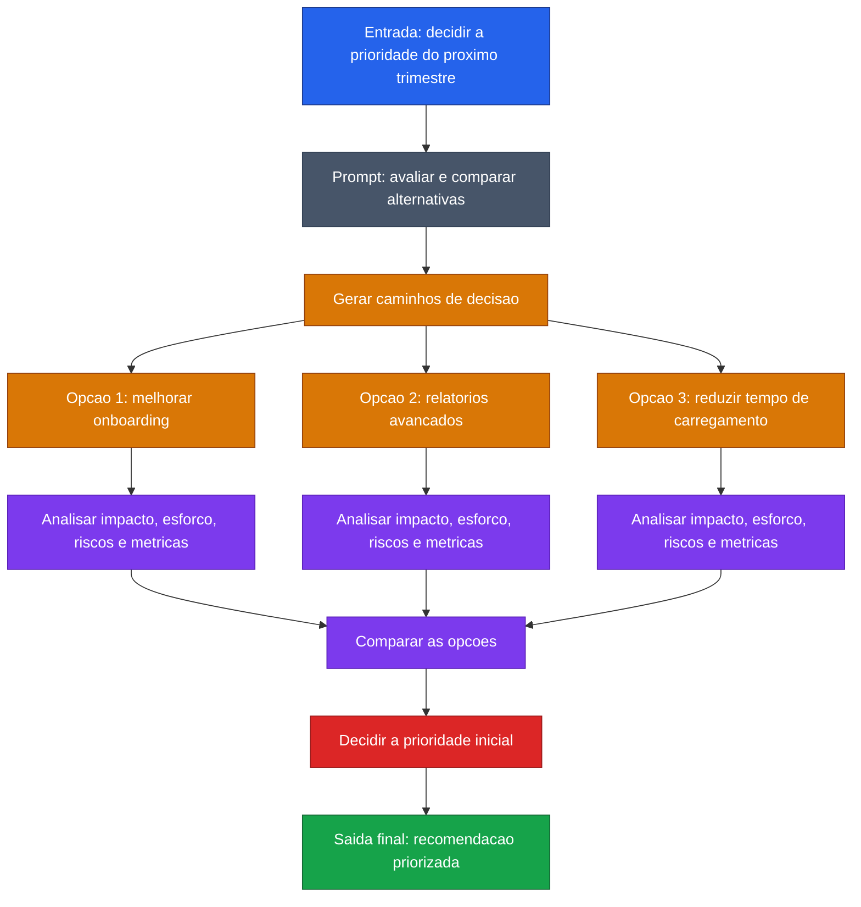

[Voltar ao indice](../README.md)

### Exemplo de prompt (Tree-of-Thought) — Priorizacao de funcionalidade
Caso de uso: quando a equipe precisa escolher entre opcoes concorrentes e justificar a prioridade com criterios objetivos. Aqui, o modelo compara impacto, esforco, riscos e metricas antes de recomendar o que vem primeiro.

Entrada:
```code-block
Voce e um Product Manager e precisa decidir qual funcionalidade deve ser priorizada no proximo trimestre.

Use a abordagem Tree of Thought para analisar o problema.

Avalie estas 3 opcoes:
1. Melhorar o onboarding de novos usuarios
2. Criar uma funcionalidade de relatorios avancados
3. Reduzir o tempo de carregamento do produto

Para cada opcao:
- explique o impacto esperado no negocio
- avalie impacto na experiencia do usuario
- considere esforco de implementacao
- identifique riscos
- diga quais metricas seriam influenciadas

Depois:
- compare os caminhos
- indique qual opcao deve ser priorizada primeiro
- justifique a decisao
- proponha uma recomendacao final
```

### Diagrama de Fluxo



> **Caracteristica:** ToT para priorizacao de produto. Cada funcionalidade e avaliada em 5 dimensoes antes da decisao final.
