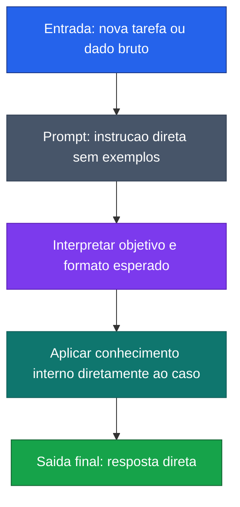

[Voltar ao indice](../README.md)

### Exemplo de prompt (Zero-Shot)
Caso de uso: quando a tarefa e direta e o modelo nao precisa de exemplos previos para entender o que deve fazer. Aqui, o objetivo e extrair campos basicos de um CSV anexado da forma mais simples possivel.

Entrada:
```code-block
Extraia os dados do CSV e retorne nome, sobrenome e matricula.

Agora processe esta entrada do arquivo anexado.
```

### Diagrama de Fluxo



> **Caracteristica:** Nenhum exemplo e fornecido. O modelo depende exclusivamente do conhecimento pre-treinado para interpretar e executar a tarefa.
